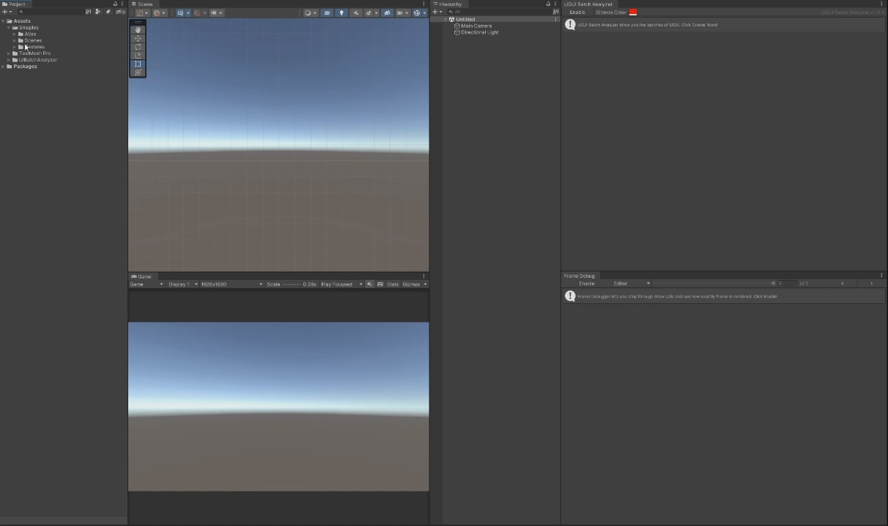
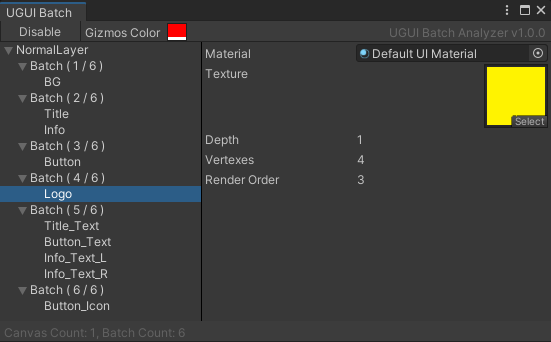

# UGUI合批分析工具
优化UGUI的Drawcall时，一般使用Unity提供的FrameDebugger来查看合批情况。但就我个人使用来看，用FrameDebugger优化UI有以下几个不足
> - 不够直观，不能快速定位构成Drawcall的控件
> - 在编辑模式下，对SpriteAtlas的支持并不好

所以开发了这个分析UGUI合批情况的工具，可以作为FrameDebugger的辅助和补充

> [!IMPORTANT]  
> UGUI 合批的原理和细节，详见文档： [UGUI 合批原理](https://github.com/simplex86/cheatsheet-uguibatch) 

## Feature
- [X] Text (Legacy)
- [X] TextMeshPro
- [X] Image
- [X] RawImage
- [X] Mask
- [X] RectMask2D
- [X] Nested Canvas

## 使用指南
- 菜单 SimpleX -> UIBatch Profiler，打开UGUI Batch窗口 
- 点击“Enable”按钮，启动Batch分析功能 
- 左边列出每个Canvas下的Batch及其UI控件的组成。选中某个节点后，会在右边显示详细信息 
- 点击“Disable”按钮，关闭Batch分析功能

> [!NOTE]  
>如果在Inspector中修改某些属性后没有自动刷新Batch数据，请手动刷新（先Disable，再Enable）

## 重要说明
### SpriteAtlas
通常使用Image的初衷是利用SpriteAtlas来降低Drawcall，但SpriteAtlas存在几个特性
> - 编辑器在 **非 Play Mode 时** 不会为SpriteAtlas实时生成Texture，此时会直接引用Sprite对应的Texture（即使 **Project Settings->Editor->Sprite Packer** 设置为 **Always Enabled** ，也只会在 **Play Mode 时** 生成Texture）；
> - 如果SpriteAtlas的尺寸设置得太小，可能会生成多张Texture；
> - 如果某个Sprite同时Pack到多个SpriteAtlas中，无法判断在运行时会使用哪个SpriteAtlas生成的Texture。

由此，在 **非 Play Mode 时** UI合批会出现以下几个情况
> - 在FrameDebugger中，引用不同Sprite的Image无法合批；
> - 本工具尝试用SpriteAtlas代替Texture作为能否合批的依据，但这**并不完全精确**（因为SpriteAtlas可能生成多张Texture）。

因此建议修改UI优化Drawcall后，点击Play按钮运行起来确定最终的结果

### 3D UI
UGUI中的3D UI有几个特点
> - position的Z轴不为0或rotation的XY轴不为0时，UGUI会把该节点及其子节点当做**3D UI**
> - 3D UI不参与2D UI的合批

具体的合批规则还没有得到确信的资料，所以目前本工具暂时不支持对3D UI的合批情况进行分析。同时建议在制作2D UI时确保各个节点position的Z轴和rotation的XY轴的值为0，避免增加不必要的Drawcall。

## 测试环境
#### Windows
- [X] Unity 2020.3.44f1
- [X] Unity 2021.3.6f1
- [X] Unity 2021.3.18f1
- [X] Unity 2022.2.8f1
- [X] Unity 2022.3.34f1
#### Mac
- [ ] Unity 2020
- [ ] Unity 2021
- [ ] Unity 2022

## UGUI 合批原理

在编写本工具时，查了不少资料也做了不少实验，现将这些信息整理成文档：[UGUI 合批原理](https://github.com/simplex86/cheatsheet-uguibatch) 
