# UGUI 合批原理

- [合批规则](#合批规则)
- [合批流程](#合批流程)
    - [计算 Depth](#计算-Depth)
        - [BottomUI](#bottomui)
        - [Depth](#depth)
    - [计算 Drawcall](#计算-Drawcall)
- [Mask 和 RectMask2D](#Mask-和-RectMask2D)
    - [Mask](#Mask)
    - [MaskRect2D](#MaskRect2D)
- [优化建议](#优化建议)
- [参考文献](#参考文献)

## 合批规则

- 以 Canvas 为单位进行批次生成和渲染（Canvas 可以嵌套）
- 材质球（材质球的 instanceId 和纹理的 instanceId）相同的两个 UI 控件才**有可能**合批

## 合批流程

- 计算 Canvas alpha（包括父 Canvas 和嵌套 Canvas），alpha = 0 不生成合并批次
- UI 层次结构发生变化时，更新 Batch 顺序，对 Canvas 下所有UI元素（CanvasRenderer）按 UI 层次结构深度优先排序，生成 UI Instructions
- 更新所有需要同步的 Renderer UI 数据，包括 vertex, color, material, transform, rect, depth（按UI层次结构深度优先排序的深度）等
    > 非活动（IsActive() == false）且不强制更新的 UI 元素，将不同步数据
- Canvas 数据更新时（m_CanvasData.orderIsDirty == true），计算 UI Instructions 的 depth 并排序、生成 Batch
    > 层次结构改变，同步关键数据，Canvas.Awake等情况都可以引发 Canvas 数据更新

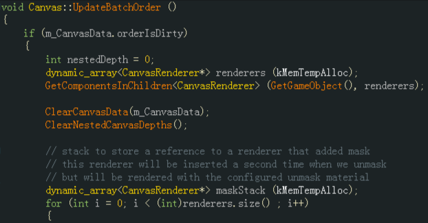

### 计算 Depth

要计算 UI 的 Depth，首先要搞清楚 BottomUI 的概念

#### BottomUI

A 是 B 的 BottomUI 需要满足：

- B 的 mesh 构成的矩形和 A 的 mesh 构成的矩形有相交
    > 不是 RectTransform 的矩形相交
- A.SiblingIndex < B.SiblingIndex
    > 在 Hierachy 里 A 在 B 之上
- 如果 B 有多个UI满足1、2条规则，则 B 的 BottomUI 取 SiblingIndex 差值的绝对值最小的那个

看以下示例

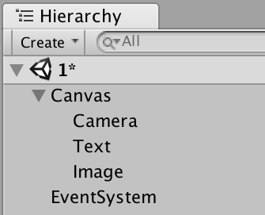

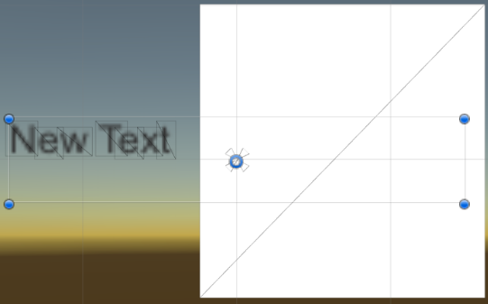

Text 和 Image 的 mesh（黑色线框）是没有相交的，但他们的 RectTransform 却是相交的。此时，Text 不能算作 Image 的 BottomUI，因为不满足第1条。

#### Depth

遍历所有 UI 元素（已深度优先排序），对每个 UI 组件

- 如果不渲染，则 depth = -1
- 否则
    - 如果有 BottomUI
        - 如果 material.instanceId 和 texture.instanceId 相同，则 depth = BottomUI.depth
        - 否则，depth = BottomUI.depth + 1
    - 否则，depth = 0

> [!IMPORTANT]  
> Depth 是 UGUI 渲染排序的**第一参考值**

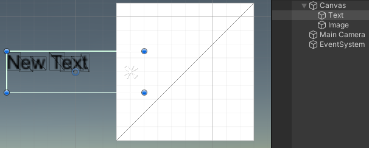

看以下示例

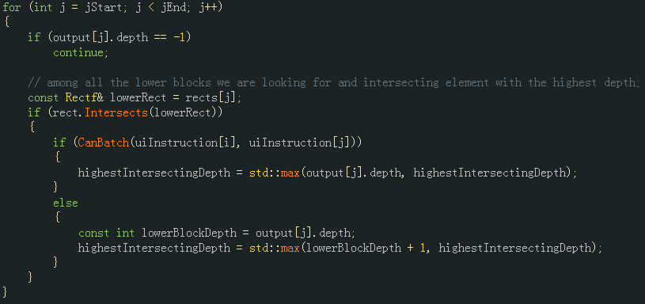

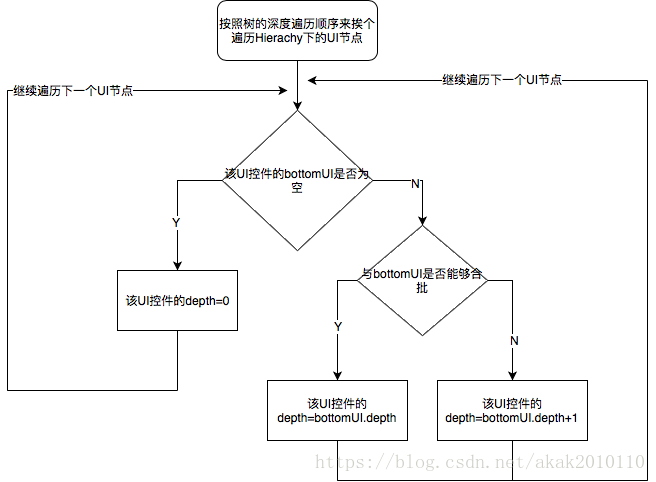

深度优先遍历，得到 UI 控件遍历顺序：I1、T1、I2、R2、R1。根据 Depth 的计算规则，得到每个 UI 控件的 Depth 值

| 名字 | Depth | 说明 |
|------|------|------|
| I1 | 0 | |
| T1 | 1 | |
| I2 | 2 | I2 的 Botom UI 是 T1，且两者的 mesh 有相交，还不能合批，所以 I2.Depth = T1.Depth + 1= 1 + 1 = 2 |
| R2 | 2 | R2.SiblingIndex - I2.SiblingIndex = 1，R2.SiblingIndex - I1.SiblingIndex = 3，依据 BottomUI 规则的第3条， R2 的 BottomUI 是 I2（而非 I1）。且 R2 和 I2 能够合批（后文会解释），所以 R2.Depth = I2.Depth = 2 |
| R1 | 2 | |

> [!NOTE]  
> 不要以为 I2 和 R2 的控件类型不一样就不能合批了，UGUI 的渲染引擎不会考虑 UI 控件类型，它只考虑两个 UI 控件的材质球及其参数是否一样：如果一样，就可以合批；否则不能合批。在这个案例中，I2和R2使用的材质球（Default UI Material）和 纹理（Unity White）都是一样的，所以能够合批。
>  
> 另外，我们往往都会认为一个 RawImage 就会占用一个 Drawcall，其实这个说法只是一种经验，并不完全正确。因为我们使用 RawImage 的时候都是拿来显示一些单张的纹理，比如好友列表里的头像，如果这些头像都是玩家自定义上传的头像，往往互不相同，当渲染到 RawImage 的时候，就会导致头像的材质球使用的纹理不同而导致不能合批而各占一个 Drawcall。但如果是使用的系统头像，那么就可以让两个使用了相同系统头像的 RawImage 合批。

### 计算 Drawcall

- 依次根据Depth、material ID、texture ID、RendererOrder（即UI层级队列顺序，HierarchyOrder）排序（条件的优先级依次递减），剔除depth == -1的UI元素，得到合批前的 UI 元素队列VisiableList

    

    其中的 renderOrder 可以理解为 siblingIndex，更直观的表示如下图

    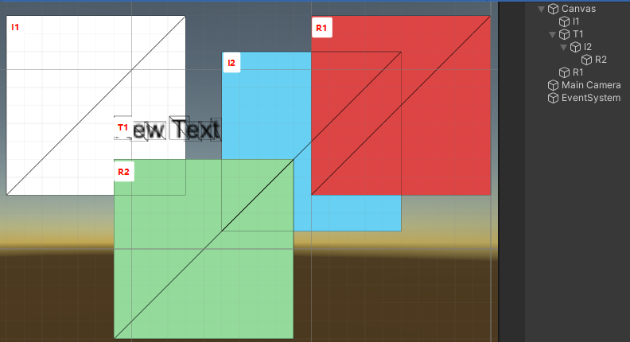

- 对 VisiableList 中相邻且可以合批（相同material和texture等）的 UI 元素合并批次，然后再生成相应 mesh 数据进行绘制。

看以下示例

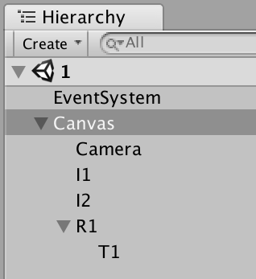

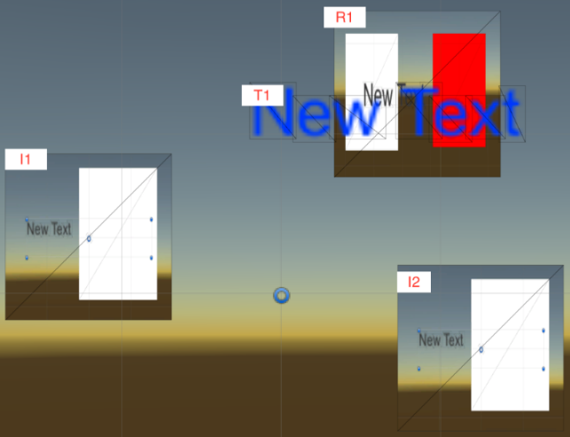

| 名字 | 材质球 | 纹理 |
|------|------|------|
| I1 | M_InstID_Bigger | texture_InstID_Smaller |
| I2 | M_InstID_Smaller | texture_InstID_Smaller |
| R1 | M_InstID_Bigger | texture_InstID_Bigger |
| T1 | UI Default Matiaral(UGUI 默认材质球) | Font Texture(unity自带的一个字体纹理) |

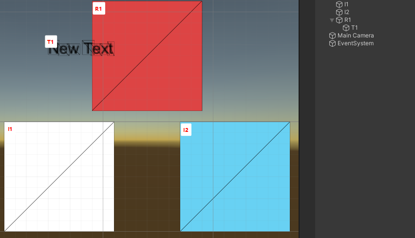

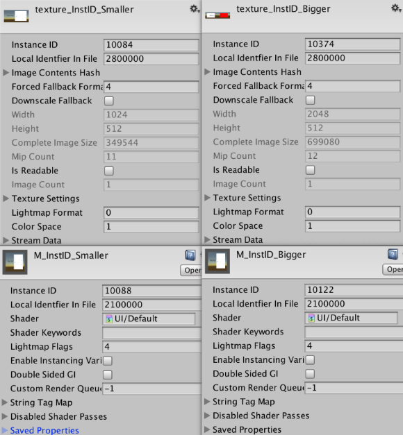

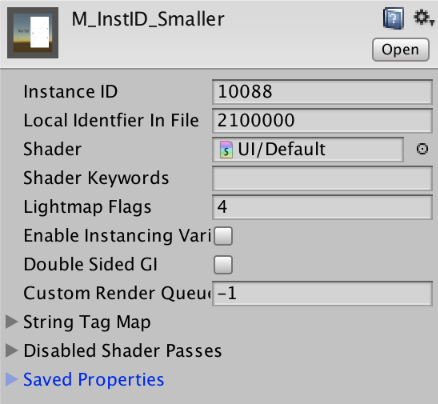

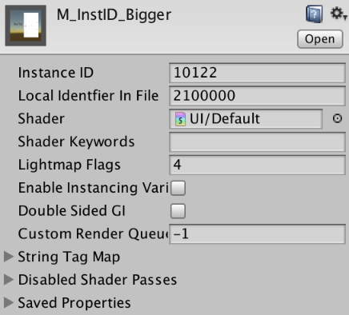

- 步骤1：计算各个 UI 控件的 Depth 值

    | 名字 | Depth |
    |------|------|
    | I1 | 0 |
    | I2 | 0 |
    | R1 | 0 |
    | T1 | 1 |

- 步骤二：排序

    - 按 Depth 值做升序排序：得 I1、I2、R1、T1

    - 材质球 ID 排序：因为 I1、I2、R1的 Depth 值相等，那么再对他们进行材质球ID进行升序排序
        > I2.materialID < I1.materialID = R1.materialID

        经过材质球排序后：I2、I1、R1、T1

    - 纹理 ID 排序：因为I1和R1的材质球ID相同，故需要进行纹理ID降序排序
        > R1.TexutureID > I1.TextureID

        经过纹理排序后：I2、R1、I1、T1

    至此，就把所有的UI控件都排好序了，得到了所谓的 VisibleList = { I2, R1, I1, T1 }

    | 名字 | Depth |
    |------|------|
    | I2 | 0 |
    | R1 | 0 |
    | I1 | 0 |
    | T1 | 1 |

- 步骤三：对 **Depth 相等的连续相邻 UI 控件**进行合批。

    > [!IMPORTANT]  
    > 只有 **Depth 相等**的、**连续且相邻**的 UI 才考虑合批！

    很显然，I2，I1，R1 虽然他们 Depth 相等，但不符合合批条件，所以都不能合批。

- 步骤四：计算 Drawcall

    合批步骤完成后就可以计算 Drawcall 数了：Drawcall 数 = 合批1 + 合批2 + … + 合批n = n * 1 = n

这个案例中，渲染顺序是：先画 I2，其次 R1，其次 I1，最后T1，Drawcall 数 = 1 + 1 + 1 + 1 = 4

## Mask 和 RectMask2D

UI 中 Mask 非常常见，很多时候都需要它，比如滚动列表。要想精算 Drawcall 数和渲染顺序，就必须掌握 Mask 对 Drawcall 和渲染顺序的影响。

### Mask

Mask 组件需要依赖 Image 组件，裁剪区域就是 Image 的大小。其性质如下：

- Mask 会在首尾（首 = Mask 节点，尾 = Mask 子节点遍历完后）多出两个 Drawcall，多个 Mask 间如果符合合批条件这两个 Drawcall 可以对应合批（mask1 的首 和 mask2 的首合；mask1 的尾 和 mask2 的尾合，首尾不能合）
- 计算 Depth 的时候，当遍历到一个 Mask 的首，把它当做一个不可合批的 UI 节点看待，但可以作为其孩子 UI 节点的 BottomUI
- 如果 Mask 的子节点属于同一个 Atlas，那么 Mask 之间的元素可以进行合并；否则不能合并
- Mask 外的元素和 Mask 内的元素，无法合批

> [!NOTE]  
> Mask 的原理是一个 Drawcall 来创建 Stencil Mask（做像素剔除），然后绘制所有子 UI，再在最后一个 Drawcall 移掉 Stencil Mask。  
> 详见：[Unity UGUI Mask组件实现原理](https://blog.csdn.net/qq826364410/article/details/85103488?spm=1001.2101.3001.6650.2&utm_medium=distribute.pc_relevant.none-task-blog-2%7Edefault%7Ebaidujs_baidulandingword%7ECtr-2-85103488-blog-131171958.235%5Ev43%5Epc_blog_bottom_relevance_base6&depth_1-utm_source=distribute.pc_relevant.none-task-blog-2%7Edefault%7Ebaidujs_baidulandingword%7ECtr-2-85103488-blog-131171958.235%5Ev43%5Epc_blog_bottom_relevance_base6&utm_relevant_index=5)

### RectMask2D

RectMask2D 不需要依赖 Image 组件，其裁剪区域就是它的 RectTransform 的大小。其性质如下：

- RectMask2D 节点下的所有子节点都不能与外部 UI 节点合批
- 多个 RectMask2D 之间不能合批
- 计算 Depth 时，RectMask2D 都按普通 UI 节点看待，但不能看做任何 UI 控件的BottomUI
    > 因为它没有 CanvasRenderer 组件

> RectMask2D 的原理是先将那些不在其矩形范围内的元素透明度设置为0，然后通过 Shader 丢弃掉透明度小于 0.001 的元素。  
> 详见：[Unity遮罩之RectMask2D详细解读](https://www.cnblogs.com/iwiniwin/p/15170384.html)

利用 Mask 和 MaskRect2D 的性质，结合前文的合批规则，就可以精算出带有 Mask/MaskRect2D 的 UI 的 Drawcall 数和渲染顺序。虽然 Mask 的名声不是很好，但从 Mask 的性质可以看出**并不是 Mask 越多越不好**，因为 **Mask 间是可以合批的**：

- 当界面只有一个 Mask 时，RectMask2D 优于 Mask
- 当有两个 Mask，两者差不多
- 当大于两个 Mask，Mask 优于 RectMask2D

## 优化建议

从 UGUI 合批规则可以看出，提高UI性能尽量注意以下几点：

- 尽量避免使用 Mask，使用 Mask 至少增加两个 Drawcall，并可能导致本可以 Batch 的 UI 元素无法 Batch，从而增加更多 Drawcall
- 避免在 UI 树形结构下（ Canvas 下）频繁删除/增加 UI 对象，UI 层次结构发生变化会引起整个 Canvas UI 顺序更新，特别是复杂的 UI 树形结构
- 避免频繁动态的更新 UI 元素的 Vertex, Rect, Color, Material, Texture 等，可能引起 Canvas 数据更新和 Batch 更新计算，有可能引起 VBO Update（重新提交顶点数据）
- 尽可能使用少的 UI Material 和贴图（使用图集），使得可以 Batching
- 相邻的 UI 元素（比如父节点与第一个子节点、相同层次结构下的节点），使用相同材质贴图的 UI 元素尽可能排在一起，便于合并
- 同一父节点下所有子节点，保持相同的层次结构（如 List 控件下的 Item），便于底层相同 depth 下 UI 元素 Batch
- 避免 UI 元素数目过多和层次结构过于复杂影响 Batch 更新速度
- 固定的 Text 考虑与背景图层合在一张图上（可能不便本地化）

## 参考文献

- [UGUI drawcall合并](https://blog.csdn.net/akak2010110/article/details/80953370?spm=1001.2101.3001.10752)
- [UGUI 之 Mask 和 RectMask2D 与 drawcall](https://blog.csdn.net/akak2010110/article/details/80964416)
- [UGUI合批源码分析及优化](https://blog.csdn.net/qq826364410/article/details/80983861)

> 文中涉及的所有（疑似）uGUI 源码都基于 Unity 4.6 版本